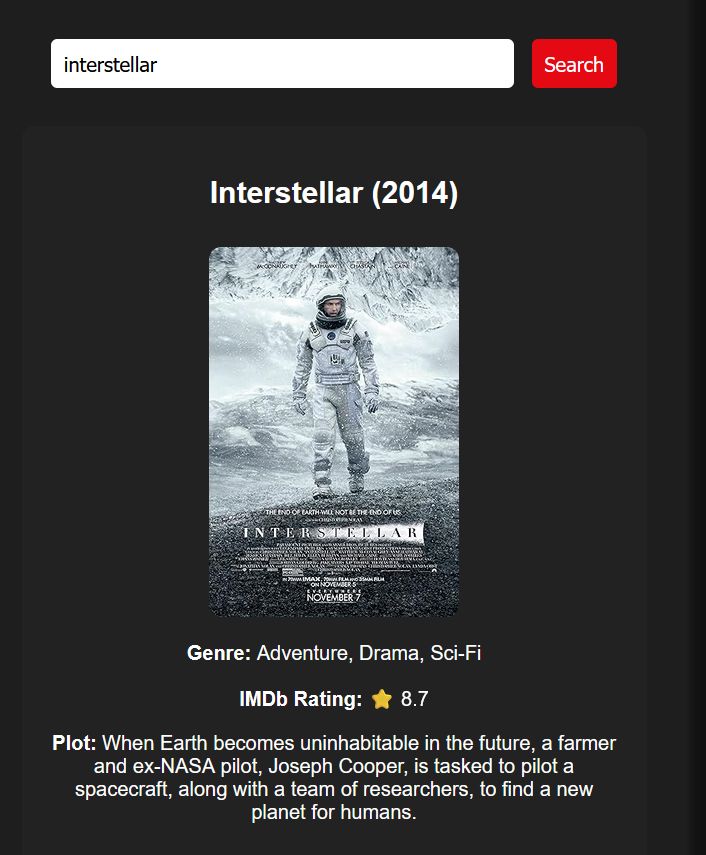

# movie-search-app
"movie", "api", "javascript", "vanilla-js", "web-app", "frontend"

# 🎬 Movie Search App

A simple web app to search movies by **title** or **actor name** using the [OMDb API](https://www.omdbapi.com/).

## 📸 Screenshot

 

---

## 🚀 Features

- 🔍 Search by **Movie Title** (shows full details: poster, plot, genre, rating)
- 🎨 Clean and responsive UI
- 🌐 Uses [OMDb API](https://omdbapi.com/) to fetch real movie data

---

## 🛠️ Built With

- HTML
- CSS
- JavaScript (Vanilla)
- OMDb API

---

